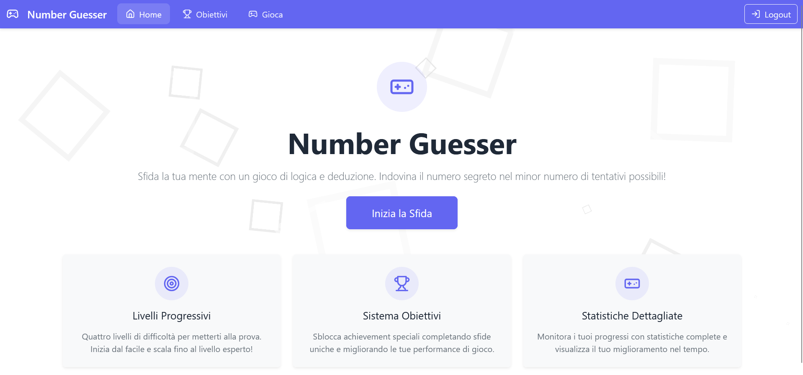
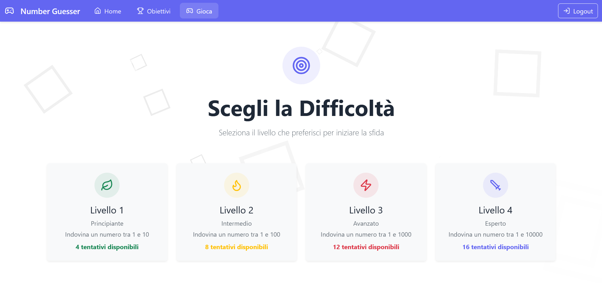
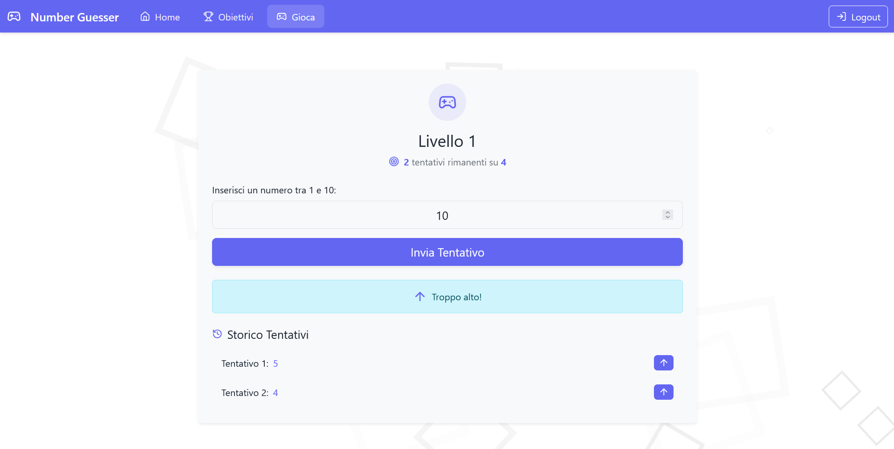
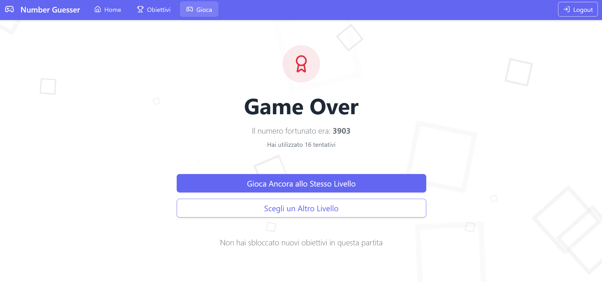
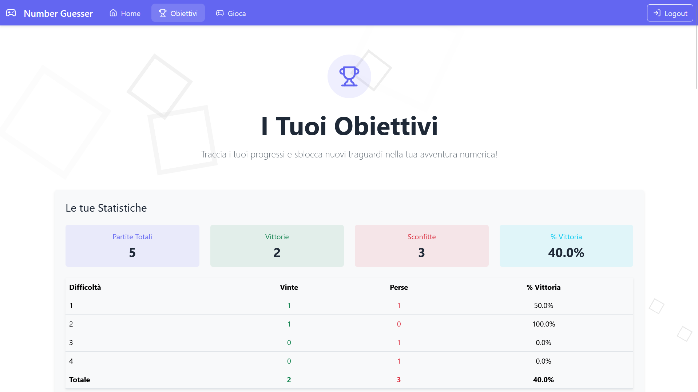
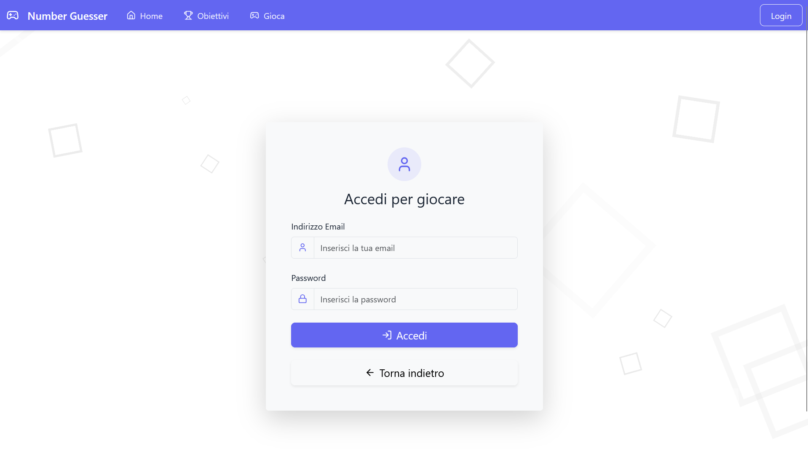

[](https://classroom.github.com/a/hUwC007-)
# Exam #4: "Obiettivi"
## Student: s332195 BISSANTI MICHELE

## React Client Application Routes

- Route `/`: Route verso la pagina principale dell'applicazione
- Route `/login`: Route verso la pagina di login dell'applicazione
- Route `/play`: Route verso la sezione gioco dell'applicazione: se si è loggati, è possibile scegliere il livello di difficoltà, giocare e visualizzare i risultati di fine partita
- Route `/goals`: Route verso la sezione "Obiettivi" dell'applicazione. Se l'utente è loggato, verranno visualizzati tutti gli obiettivi con il loro stato di completamento e le statistiche di tutte le partite giocate. Se l'utente non è loggato, verrà mostrata solo la lista degli obiettivi ottenibili
- Route `*`: "No match" route. Viene visualizzato un messaggio "Pagina non trovata", avviene se l'utente vuole navigare in route non definite


## API Server

### GET `/api/goals`
- **Description**: Recupera tutti gli obiettivi raggiungibili nell'applicazione.
- **Response**:
  - `200 OK`: Successo. Restituisce un array di obiettivi.
  - `500 Internal Server Error`: Errore generico del server.
- **Request Body**: Nessuno.
- **Response Body**:
  ```json
  [
    {
      "id": 1,
      "name": "Benvenuto",
      "condition": "Completa la tua prima partita",
      "description": "Hai completato la tua prima partita, ben fatto!",
      "icon": "🎉",
      "repeatable": false
    },
    ...
  ]

### GET `/api/goals/:userId`
- **Description**: Recupera tutti gli obiettivi avvalorati con i dati di raggiungemento dell'utente specifico. Bisogna essere loggati per utilizzare questa API.
- **Response**:
  - `200 OK`: Successo. Restituisce un array di obiettivi dell'utente.
  - `401 Unauthorized`: Utente non autorizzato.
  - `422 Unprocessable Entity`: Codice utente errato.
  - `500 Internal Server Error`: Errore generico del server.
- **Request Params**:
  - `userId` (integer): ID dell'utente
- **Request Body**: Nessuno.
- **Response Body**:
  ```json
  [
    {
      "id": 1,
      "name": "Benvenuto",
      "condition": "Completa la tua prima partita",
      "description": "Hai completato la tua prima partita, ben fatto!",
      "icon": "🎉",
      "repeatable": false,
      "achieved": true,
      "timeAchieved": 1,
      "achievedAt": "2025-01-19"
    },
    ...
  ]

### GET `/api/stats/:userId`
- **Description**: Recupera le statistiche delle partite di un utente specifico. Bisogna essere loggati per utilizzare questa API.
- **Response**:
  - `200 OK`: Successo. Restituisce un array di statistiche.
  - `401 Unauthorized`: Utente non autorizzato.
  - `422 Unprocessable Entity`: Codice utente errato.
  - `500 Internal Server Error`: Errore generico del server.
- **Request Params**:
  - `userId` (integer): ID dell'utente
- **Request Body**: Nessuno.
- **Response Body**:
  ```json
  [
    {
      "difficulty": 1,
      "won": 10,
      "lost": 5
    },
    ...
  ]

### POST `/api/game`
- **Description**: Salva una partita nel database e controlla gli obiettivi raggiunti. Bisogna essere loggati per utilizzare questa API.
- **Response**:
  - `201 Created`: Successo. Restituisce un array di nuovi obiettivi raggiunti.
  - `401 Unauthorized`: Utente non autorizzato.
  - `422 Unprocessable Entity`: Dati non validi.
  - `500 Internal Server Error`: Impossibile salvare la partita o controllare gli obiettivi raggiunti.
- **Request Body**:
  ```json
  {
    "difficulty": 1,
    "attemptsHistory": [3, 5, 7],
    "targetNumber": 7,
    "date": "2024-02-07",
    "userId": 1,
    "status": "won"
  }
  
- **Response Body**:
  ```json
  [
    {
      "id": 1,
      "name": "Benvenuto",
      "condition": "Completa la tua prima partita",
      "description": "Hai completato la tua prima partita, ben fatto!",
      "icon": "🎉",
      "repeatable": false,
      "achieved": true,
      "timeAchieved": 1,
      "achievedAt": "2024-02-07"
    },
    ...
  ]

### POST `/api/sessions`
- **Description**: Effettua il login dell'utente. L'autenticazione avviene con passport.js in local strategy e viene eseguita nello user-dao.js la funzione getUser per prelevare l'utente dal database facendo i dovuti confronti con lo username e la password criptata con sale.
- **Response**:
  - `201 Created`: Successo. Restituisce le informazioni dell'utente autenticato.
  - `401 Unauthorized`: Email o password errati.
- **Request Body**:
  ```json
  {
    "username": "user@example.com",
    "password": "password"
  }
  
- **Response Body**:
  ```json
  {
    "id": 1,
    "username": "user@example.com",
    "name": "User Name"
  }

### GET `/api/sessions/current`
- **Description**: Recupera le informazioni dell'utente autenticato. I dati dell'utente vengono recuperati dal cookie con deserializeUser chiamando la funzione nel user-dao.js getUserById, funzione utile anche per capire se l'utente è effettivamente ancora presente nel db.
- **Response**:
  - `200 OK`: Successo. Restituisce le informazioni dell'utente autenticato.
  - `401 Unauthorized`: Utente non autenticato.
- **Request Body**: Nessuno.
- **Response Body**:
  ```json
  {
    "id": 1,
    "username": "user@example.com",
    "name": "User Name"
  }

### DELETE `/api/sessions/current`
- **Description**: Effetua il logout dell'utente
- **Response**:
  - `200 OK`: Successo.
- **Request Body**: Nessuno.
- **Response Body**: Nessuno.

## Database Tables

### Tabella `goal`
- **Descrizione**: Contiene gli obiettivi raggiungibili nell'applicazione.
- **Colonne**:
  - `id` (INTEGER): Identificativo univoco dell'obiettivo. Chiave primaria.
  - `name` (VARCHAR): Nome dell'obiettivo. Non nullo.
  - `condition` (TEXT): Condizione per raggiungere l'obiettivo. Non nullo.
  - `description` (TEXT): Descrizione dell'obiettivo.
  - `icon` (VARCHAR): Icona associata all'obiettivo.
  - `repeatable` (BOOLEAN): Indica se l'obiettivo è ripetibile. Default: FALSE.

### Tabella `user`
- **Descrizione**: Contiene le informazioni degli utenti registrati.
- **Colonne**:
  - `id` (INTEGER): Identificativo univoco dell'utente. Chiave primaria.
  - `name` (VARCHAR): Nome dell'utente. Non nullo.
  - `email` (VARCHAR): Email univoca dell'utente. Non nullo.
  - `password` (VARCHAR): Password dell'utente. Non nullo.
  - `salt` (VARCHAR): Salt utilizzato per l'hashing della password. Non nullo.

### Tabella `user_goal`
- **Descrizione**: Contiene le relazioni tra utenti e obiettivi raggiunti.
- **Colonne**:
  - `id` (INTEGER): Identificativo univoco della relazione. Chiave primaria.
  - `date` (DATETIME): Data in cui l'obiettivo è stato raggiunto. Non nullo.
  - `user_id` (INT): Identificativo dell'utente. Chiave esterna che fa riferimento alla tabella `user`.
  - `goal_id` (INT): Identificativo dell'obiettivo. Chiave esterna che fa riferimento alla tabella `goal`.

### Tabella `game`
- **Descrizione**: Contiene le informazioni delle partite giocate dagli utenti.
- **Colonne**:
  - `id` (INTEGER): Identificativo univoco della partita. Chiave primaria.
  - `difficulty` (INTEGER): Difficoltà della partita. Non nullo.
  - `attempts_history` (TEXT): Storico dei tentativi effettuati durante la partita. Non nullo.
  - `target_number` (INT): Numero obiettivo della partita. Non nullo.
  - `date` (DATETIME): Data in cui la partita è stata giocata. Non nullo.
  - `user_id` (INT): Identificativo dell'utente che ha giocato la partita. Chiave esterna che fa riferimento alla tabella `user`.
  - `status` (VARCHAR): Stato della partita (es. 'in progress', 'won', 'lost').

## Main React Components

- [`App`](./client/src/App.jsx): Componente principale dell'applicazione che gestisce le rotte e lo stato di autenticazione dell'utente.
- [`LoginForm`](./client/src/components/AuthComponents.jsx): Form di login per l'autenticazione dell'utente.
- [`LogoutButton`](./client/src/components/AuthComponents.jsx): Bottone per effettuare il logout dell'utente.
- [`GameBoard`](./client/src/components/GameBoard.jsx): Componente che gestisce la logica e l'interfaccia del gioco.
- [`GoalCard`](./client/src/components/GoalCard.jsx): Componente che visualizza le informazioni di un singolo obiettivo.
- [`NavHeader`](./client/src/components/NavHeader.jsx): Barra di navigazione principale dell'applicazione.
- [`NotFound`](./client/src/components/NotFoundComponent.jsx): Componente che visualizza un messaggio di errore quando una pagina non viene trovata.
- [`StatsTable`](./client/src/components/StatsTable.jsx): Tabella che visualizza le statistiche delle partite dell'utente.
- [`HomePage`](./client/src/pages/HomePage.jsx): Pagina principale dell'applicazione che introduce il gioco e le sue funzionalità.
- [`GamePage`](./client/src/pages/GamePage.jsx): Pagina che gestisce la selezione della difficoltà del gioco e visualizza i risultati delle partite.
- [`GoalsPage`](./client/src/pages/GoalsPage.jsx): Pagina che visualizza gli obiettivi raggiunti e le statistiche dell'utente.
- [`Background`](./client/src/components/Background.jsx): Componente che visualizza il background animato

## Screenshot











## Users Credentials

- michele.bissanti01@gmail.com, michele
- luigi.derussis@polito.it, testtest
- luca.mannella@polito.it, luca.mannella (nessuna partita giocata)
- mario.rossi@email.it, mario.rossi (nessuna partita giocata)
- luigi.verdi@email.it, luigi.verdi (nessuna partita giocata)
